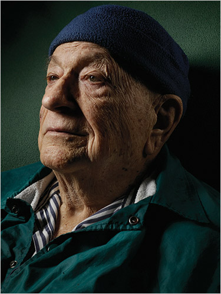

# Jack Vance

Jack Vance was an American mystery, fantasy and science fiction author. Vance's oeuvre spans more 50 novels and 100 short stories. Most of his work has been published under the name Jack Vance. He published 11 mysteries as ***John Holbrook Vance*** and 3 as ***Ellery Queen***. Other pen names (each used only once) included ***Alan Wade***, ***Peter Held***, ***John van See***, and ***J A Kavnnes***.

Among his awards are: Hugo Awards, in 1963 for The
Dragon Masters, in 1967 for The Last Castle, and in 2010
for his memoir This is Me, Jack Vance!; a Nebula Award in
1966, also for The Last Castle; the Jupiter Award in 1975;
the World Fantasy Award in 1984 for life achievement and
in 1990 for Lyonesse: Madouc; an Edgar (the mystery
equivalent of the Nebula) for the best first mystery novel in 1961 for The Man in the Cage; in 1992, he
was Guest of Honor at the WorldCon in Orlando, Florida; and in 1997 he was named a SFWA Grand
Master. A 2009 profile in the New York Times Magazine described Vance as "one of American
literature’s most distinctive and undervalued voices."

Vance's last novel, the autobiography "This is Me, Jack Vance!", was released in the summer of 2009. In
this book Vance gives us an intimate and fascinating glimpse into his rich and eventful life. Vance calls it
"more of a landscape than a self-portrait -- or at least a ramble across the landscape that has been my life."

Jack Vance spent his 'post-writing' years making jazz music, he even released an entire jazz-album only
two months ago, and kept abreast of what went on in the world (science, politics, general news) with a
keen and honest interest in a steady stream of visitors and admirers.