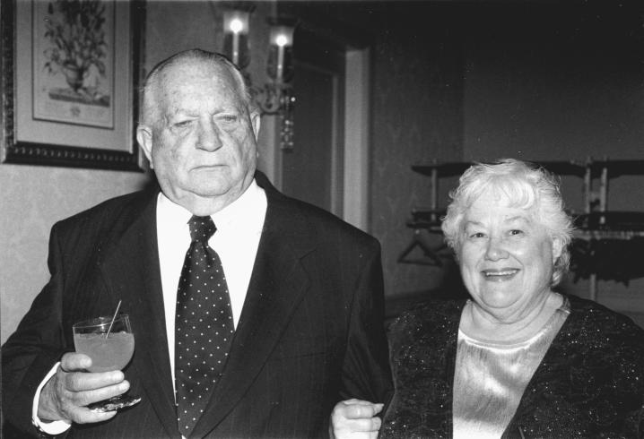
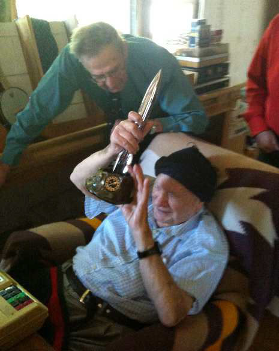
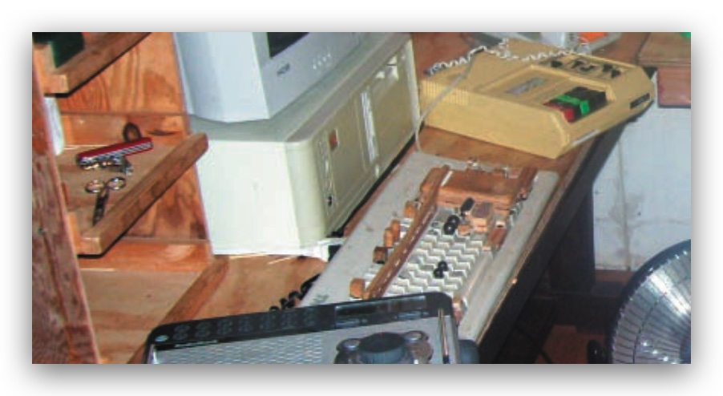
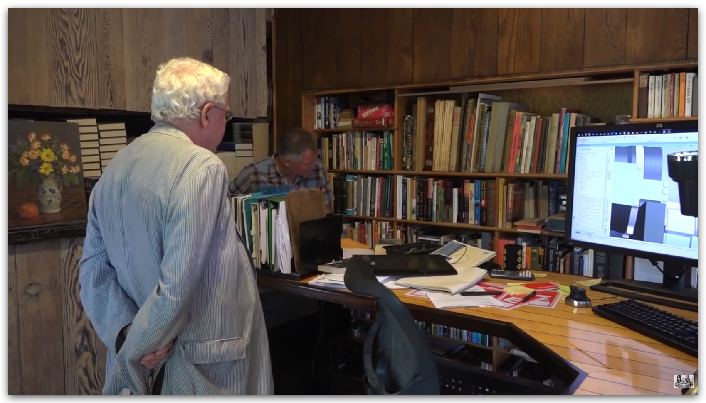
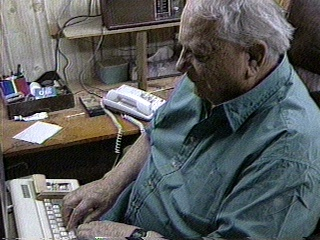

# Jack Vance

Jack Vance was an American mystery, fantasy and science fiction author. Vance's oeuvre spans more 50 novels and 100 short stories. Most of his work has been published under the name Jack Vance. He published 11 mysteries as ***John Holbrook Vance*** and 3 as ***Ellery Queen***. Other pen names (each used only once) included ***Alan Wade***, ***Peter Held***, ***John van See***, and ***J A Kavnnes***.

Among his awards are: Hugo Awards, in 1963 for The
Dragon Masters, in 1967 for The Last Castle, and in 2010
for his memoir This is Me, Jack Vance!; a Nebula Award in
1966, also for The Last Castle; the Jupiter Award in 1975;
the World Fantasy Award in 1984 for life achievement and
in 1990 for Lyonesse: Madouc; an Edgar (the mystery
equivalent of the Nebula) for the best first mystery novel in 1961 for The Man in the Cage; in 1992, he
was Guest of Honor at the WorldCon in Orlando, Florida; and in 1997 he was named a SFWA Grand
Master. A 2009 profile in the New York Times Magazine described Vance as "one of American
literature’s most distinctive and undervalued voices."

Vance's last novel, the autobiography "This is Me, Jack Vance!", was released in the summer of 2009. In
this book Vance gives us an intimate and fascinating glimpse into his rich and eventful life. Vance calls it
"more of a landscape than a self-portrait -- or at least a ramble across the landscape that has been my life."

Jack Vance spent his 'post-writing' years making jazz music, he even released an entire jazz-album only
two months ago, and kept abreast of what went on in the world (science, politics, general news) with a
keen and honest interest in a steady stream of visitors and admirers.

# Norma Vance

Jack met Norma Vance in the early 1950s, and they were married shortly thereafter. Norma played a significant role in Jack's life, providing support and stability throughout his prolific writing career. Norma would type up Jack's manuscripts, which he wrote in longhand. She was a constant presence and collaborator, ensuring that Jack's creative output could continue smoothly despite the challenges of his meticulous writing process.

They had one Son, John Vance - who now manages the literary estate of Jack Vance and oversees the publication of his works through ***Spatterlight Press***.

(***source: 2016 ***John Vance***: The Joy in the Complexity of Life – JACK VANCE, ALL-ROUND MAN AND SCIENCE-FICTION POET***)"

"First drafts went to my mother for typing and correction of small errors and inconsistencies. Her first typewriters were manual, of course—and it was a big day when she got her first electric machine, an IBM Selectric. She carried a small manual machine while traveling.
Returned to my father, the typed manuscript was scrutinized, pulled apart, re-assembled, written over, expanded, compressed and distilled. He was uncompromising about clarity and economy of expression, confident with vocabulary but disinclined to use a fancy word where a simple word would do. He was un-attached to his work and excised blocks of it without sentiment if he felt the story was not optimally advanced."

"My mother (Norma) typed a second draft, typically which required less editing, though large changes were still possible and not uncommon, to the final stage."

"The third typing was reviewed and corrected one last time. Paragraphs and sections might still be struck or rewritten. This copy generally went to the publisher. 
# Travel

# Houseboats

# Music

Jack Vance was an accomplished musician, particularly skilled in playing the cornet and the ukulele. His passion for music was evident throughout his life, and he often incorporated musical themes into his writing. In his later years, Vance continued to play music, delighting friends and family with his performances.

He was specifically into pre-World War II jazz, and he played the cornet and the ukulele. Vance was part of the Berkeley/San Francisco traditional-jazz scene, and he knew and played with musicians including Dick Oxtot, P.T. Stanton and Sam Charters.

The strongest evidence is P.T. Stanton’s recollection: he specifically tells a story about Jack Vance playing alongside Stanton. Stanton was active with Bob Mielke’s and Dick Oxtot’s groups during the 1950s.

He even released a jazz album in xxxx, with the ***Go-For-Broke Jazz Band***, together with Kevin Boudeau. The album features a collection of classic jazz standards, showcasing Vance's talent and love for the genre. His musical endeavors were a testament to his multifaceted creativity and his ability to excel in both literary and musical arts.

SFWA Grand Master Jack Vance, 96, plays ukelele.

<https://www.youtube.com/shorts/oiOt6eW0pZI>

# Awards

"Jack Vance receiving the 2010 Hugo Award for Best Related Work for his memoir ***This is Me, Jack Vance!*** at Aussiecon 4, the 68th World Science Fiction Convention in Melbourne, Australia."

# VIE (Vance Integral Edition)

In the late 1990s, the Vance Integral Edition (VIE) project was initiated to create a comprehensive and authoritative collection of Jack Vance's works. This project aimed to restore Vance's texts to their original form, correcting errors and inconsistencies that had appeared in previous editions. The VIE has become an essential resource for scholars and fans alike, ensuring that Vance's literary legacy is preserved with the utmost fidelity.

Paul Rhoads was the driving force behind the Vance Integral Edition, overseeing the meticulous process of collating, editing, and restoring Jack Vance's works to their intended form. His dedication and expertise have been instrumental in ensuring the accuracy and completeness of this comprehensive collection.

# Later Years, Eyesight and writing setup

Vance's eyesight was failing already in the eighties (getting really bad during the Lyonesse years), which made it increasingly difficult for him to read and write.

Jack Vance's writing setup in his later years was adapted to accommodate his declining eyesight. He relied on a combination of assistive technologies and support from his wife, Norma, to continue his prolific writing career. This included the use of a computer program named "BigEd", displaying very large text on the screen, which allowed him to write and edit his works despite his visual impairments. Additionally, he had software written by a fan (name) to read the text aloud, enabling him to proofread and make revisions effectively. With the help of these tools and Norma's assistance, Vance was able to maintain his creative output and continue producing new works.

he'd just completed Madouc and was about to begin Ecce and Old Earth. He was experimenting with voice-synthesis software to permit his computer to read his manuscripts back to him. Between that and touch-typing he hoped to maintain a steady output of work. (***source: Joe Bergeron a visit 1989)

Jack Vance’s work station (***source: extant #23***). The most notable feature is certainly the keyboard with it’s modified keys. When Vance could still see, he used an extra large screen and special software to project the words a few inches high. Cadwal, forexample, was written during that period. By the time Vance wrote Lurulu this had become useless, and he depended totally on a mechanical read-back. Note the book-on-tape reader, to the right of the keyboard.

(***source: 2016*** John Vance: The Joy in the Complexity of Life – JACK VANCE, ALL-ROUND MAN AND SCIENCE-FICTION POET)"

John Vance: "In the 1980’s, with the help and encouragement of our friend David Alexander, my father got his first word processor, and it wasn’t long before my mother was similarly equipped. The chatter of her typing was replaced by the buzz of a printer. The process was the same but the tools were different, and manuscripts covered in colorful doodles became a thing of the past."

As his vision became worse, my father depended more and more upon a text-to-speech processor called Accent, whose synthesized voice will always be in my head. ***Accent*** was only an aid at first while larger and larger fonts were used on-screen—using ***BigEd*** software provided by our friend ***Kim Kokkonen***; but gradually it became the primary reference. Finally the monitor became superfluous, though I kept a small CRT in the system for maintenance, file-undeletions and so on.
He was never able to use a mouse or GUI, so we ran DOS. He used SmartKey heavily for keyboard aliasing (strings like “Schwatzendale” were so much easier to input by macro!). Keeping definitions up-to-date was my responsibility.

Enhancements for his work and living spaces included desks, shelves, and platforms for monitors with keyboard shelves hanging from joists above, with castered platforms for his chair to roll easily into place, all of which I built to his specification. I glued materials to his keyboards to improve navigation by feel, which we called “architecture”; without these odd and unimportant-looking bits of foam, metal, balsawood, plastic and sandpaper he was unable to work.

After Lurulu the PC was used only to organize his index of jazz music, and keep the telephone numbers of his friends ( This Is Me was dictated, and transcribed by Jeremy Cavaterra). Finally the PC was turned on only rarely, the phone numbers of his friends stored in the memory-dialer of his telephones—which were also “architecturalized” heavily.

<https://www.youtube.com/watch?v=TvuoIpTy4Ks&t=1348s>

# LEGACY - John Vance & Spatterlight Press