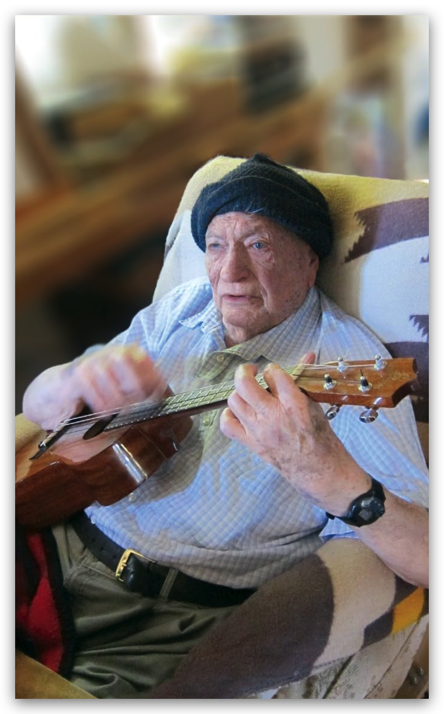

# "Jack Vance: Go For Broke" — Locus #619, August 2012
A summary and citation record for this interview, not a reproduction of it. The full text is copyrighted by Locus Publications; only brief, clearly-attributed factual points are noted here. The complete issue is held locally at `interview/Locus-2012-08.pdf` (and `.mobi`).

## Citation
*Locus* #619, August 2012, Vol. 69 No. 2, ed. Liza Groen Trombi, Locus Publications. Interview title: "Jack Vance: Go For Broke," pp. 6, continued p. 52. Cover and interview design by Francesca Myman. (Bibliographic record: ISFDB Title #1478178.)
This is one of Vance's last published interviews, appearing about nine months before his death in May 2013.
## What it covers
Alongside a standard biographical sidebar (birth, early jobs, Berkeley, Pearl Harbor, Merchant Marine service, marriage to Norma, honors, bibliography by series), the interview itself touches on: Vance's attitude toward his own reputation and craft (he describes writing primarily to earn a living rather than for recognition); his reading habits late in life (no longer reading SF/fantasy, preferring non-fiction, history, detective fiction, and the occasional western); the circumstances of writing *Vandals of the Void* on commission while living in Positano, Italy; his own ranking of his mystery novels; an anecdote about building and salvaging a houseboat with Frank Herbert and Poul Anderson; and an anecdote about Frederik Pohl, a double-sold story, and the writing of "The Last Castle" as a replacement.
## New factual points for the research record
- **Houseboat date, a third data point.** Vance himself, speaking in 2012, describes the houseboat project (with Frank Herbert and Poul Anderson) as having happened "40 years ago" — i.e., c. 1972. This conflicts with both dates already on file in `vance-life-and-works.md` (1962 and 1966). As primary testimony gathered decades after the fact, it is not automatically more reliable than the other two — see `vance-research-log.md` for the three-way discrepancy this creates.
- **Composition context for "The Last Castle" (1966).** Per Vance's account, "The Last Castle" was written as a replacement story for Frederik Pohl (then editor of *Galaxy*) after Vance's agent had sold an earlier story to two buyers at once and the sale to Pohl fell through. This is a new compositional-history detail not previously in the record; source tier is primary testimony (Vance's own recollection, 46 years after the fact).
## Source tier
Primary testimony (per `SKILL.md`'s source tiers) — Vance's own words, but reported from memory, decades after the events described. Treat accordingly: valuable for what he chose to say, not automatically authoritative over documentary evidence.

FULL TRANSCRIPTION OF THE INTERVIEW:

John Holbrook Vance was born August 28, 1916, in San Francisco, California. He worked as a bellhop, in a cannery, and on a gold dredge before attending the University of California, Berkeley, where he studied engineering, physics, and journalism, though he never graduated. A lifelong musician and music lover, Vance’s first published works were jazz reviews for *The Daily Californian*.

Vance worked as an electrician at Pearl Harbor in Hawaii, leaving the area a month before the December 1941 attack that brought the United States into World War II. His poor eyesight made it impossible for him to serve in the military, but he memorized an eye chart and joined the Merchant Marine. He wrote his first published story, “The World-Thinker” (1945), while at sea. Before becoming a full-time writer in the 1970s, he worked as a seaman, surveyor, and carpenter, among other occupations. He married Norma Genevieve Ingold in 1946; she died in 2008. Vance traveled the world extensively, living and writing in Tahiti, South Africa, Italy, and Kashmir, among other locales.

He published short fiction in the pulps in the late 1940s and early 1950s, contributing regularly to *Startling Stories* and *Thrilling Wonder Stories*. Notable short works include “Telek” (1952), “The Moon Moth” (1961), and the Hugo- and Nebula-award-winning novella “The Last Castle” (1966). Some of his short fiction was collected in *Future Tense* (1964), *The World Between, and Other Stories* (1965), *Eight Fantasms and Magics* (1969), *The Best of Jack Vance* (1976), *Green Magic* (1979), *Lost Moons* (1982), *The Narrow Land* (1982), *Light from a Lone Star* (1985), *The Dark Side of the Moon: Stories of the Future* (1985), *Galactic Effectuator* (1985), *The Augmented Agent, and Other Stories* (1986), *Chateau D’If, and Other Stories* (1990), *When the Five Moons Rise* (1992), and *The Jack Vance Treasury* (2007). His Magnus Ridolph SF stories were collected in *The Many Worlds of Magnus Ridolph* (1966; expanded 1984 as *The Complete Magnus Ridolph*).

Vance’s landmark *Dying Earth* sequence, set in the far future, began with *The Dying Earth* (1950) and continued with *The Eyes of the Overworld* (1966), *Cugel’s Saga* (1983), *Rhialto the Marvelous* (1984), and several related stories. Vance redefined the nature of planetary romance with *Big Planet* (1952), and continued exploring that universe in the sequel *Showboat World* (1975).

Most of Vance’s novels take place in series. Major works include the Demon Princes sequence: *The Star King* (1964), *The Killing Machine* (1964), *The Palace of Love* (1966), *The Face* (1979), and *The Book of Dreams* (1981); the Planet of Adventure series: *City of the Chasch* (1968), *Servants of the Wankh* (1969), *The Dirdir* (1969), and *The Pnume* (1970); the Durdane trilogy: *The Anome* (1971), *The Brave Free Men* (1973), and *The Asutra* (1974); the Alastor Cluster sequence: *Trullion: Alastor 2262* (1973), *Marune: Alastor 933* (1975), and *Wyst: Alastor 1716* (1978); the Lyonesse fantasy series: *Suldrun’s Garden* (1983), *The Green Pearl* (1985), and the World Fantasy Award-winning *Madouc* (1989); the Cadwal Chronicles: *Araminta Station* (1987), *Ecce and Old Earth* (1991), and *Throy* (1992); and the Ports of Call series: *Ports of Call* (1998) and *Lurulu* (2004).

Standalone SF/fantasy works include *The Space Pirate* (1953), *Vandals of the Void* (1953), *To Live Forever* (1956); *The Languages of Pao* (1957); *Slaves of the Klau* (1958), Hugo Award-winner *The Dragon Masters* (1963), *Son of the Tree* (1964), *The Houses of Iszm* (1964), *Space Opera* (1965), *Monsters in Orbit* (1965), *The Brains of Earth* (1966), *The Blue World* (1966), *Emphyrio* (1969); *The Gray Prince* (1974), *Maske: Thaery* (1976), and *Night Lamp* (1996).

He also wrote a number of mystery novels in the 1960s, with one, *The Man in the Cage* (1960), winning an Edgar Award. Vance wrote for *Ellery Queen* and also wrote scripts for the TV show *Captain Video*. His autobiography, *This Is Me, Jack Vance!* (2009), won a Hugo for Best Related Book.

Books about Vance include *Jack Vance*, eds. Tim Underwood & Chuck Miller (1980); *The Jack Vance Lexicon: From Ahulph to Zipangote: The Coined Words of Jack Vance*, ed. Dan Temianka (1992); and *Vance Space*, Michael Andre-Driussi (1997). The anthology *Songs of the Dying Earth*, edited by George R. R. Martin and Gardner Dozois (2009), includes original stories written in Vance’s honor.

Vance is one of the most influential SF authors from the postwar period, and his work inspired authors including Avram Davidson, Harlan Ellison, Matthew Hughes, George R. R. Martin, Michael Moorcock, and Gene Wolfe. He won the World Fantasy Award for lifetime achievement in 1984; the SFWA Grand Master Award in 1997; and he was inducted into the Science Fiction Hall of Fame in 2001. He lives in Oakland, California.

> “I’ve always let my writing speak for itself. I’m not going to go around bragging about anything. If anyone likes the stuff, they’ll find out, and if they don’t like it, they won’t. Apparently I’ve got a pretty good reputation.”

> “I don’t read any science fiction or fantasy anymore. It leaves me cold. I just read non-fiction and history and detective stories, once in a while a western story. I’ve not read science fiction or fantasy for recreation since I was a kid. I used to subscribe to *Weird Tales*. I remember running out to the mailbox — I had to run a quarter mile to get to it, we lived out in the country — to grab *Weird Tales* and take it back.”

> “I wrote to make money, not for any other purpose. I just wrote the stuff because I was pretty good at it, and I wrote as fast as I could. I don’t glorify my writing at all. For some reason I have the knack. I can’t take any credit for it, any more than you can take credit for being a beautiful girl.”

> “I was commissioned to write *The Vandals of the Void*. My agent called me and said this company was producing some books for kids and I’d been commissioned to write one. I said, ‘All right.’ I was over in Italy at the time, and I wrote it in a place called Positano. It’s a lovely place along the coast of Italy, 11 miles south of Sorrento. I wrote a murder mystery about that place, called *Strange People, Queer Notions*. I’m not too proud of my murder mysteries. I kind of like *The Fox Valley Murders* and *The Desert Valley Murder*. *Bad Ronald* was a good one. The rest of the things, they’re adequate.”

> “I’d forgotten *Locus* still existed. In the old days Charlie Brown would have parties and everyone would get gassed. I remember going up with Poul Anderson — in those days Poul was one of my really good friends. He was such a wonderful guy, one of the finest fellows I met in my whole blooming life. Frank Herbert, Poul, and I were building this houseboat up in Richmond. We had it half-constructed when a storm came up and sank it. We went out and the houseboat was just a ridge sticking up out of the water. It was dismal, of course. We said, ‘We’ve got to get it out!’ Frank Herbert said, ‘No, I’ve had it,’ and walked away from the whole thing. So Poul and I got started on diving to lift the houseboat out of the water. I got diving equipment and went down. Poul couldn’t because he had bad ears. We worked our ends off. We got some 50-gallon drums and we had to fill them with water to get them to sink. I would push these 50-gallon drums under the boat, and then we had an air compressor to put air into these drums so they floated, and up came the houseboat. We fixed the houseboat and sailed it up the river — this was 40 years ago. We had such fun in that houseboat for years after that.”

> “I remember one time Fred Pohl and I were at some kind of convention up in Reno. I went up to him and said, ‘Hey there, Fred!’ He looked at me and said, ‘Who are you?’ and I got mad and said, ‘Go to hell, I’m not going to tell you.’ I walked away from him and was standing on the stairs there, and 15 minutes later he walked up and said, ‘Jack Vance, you son of a bitch, you.’ He was editor of *Galaxy* at the time. My agent sold him a story, but he’d sold it to someone else first as well, so he got *Galaxy*’s money and the other guy’s money too. Fred Pohl couldn’t publish the story. He called me and was mad at me. I was in Tahiti at the time. He said, ‘Give me that money back!’ So I wrote him one called ‘The Last Castle’ instead, which he was happy for.”

> “I’ll tell you a story about Robert Silverberg. One day Harlan Ellison came up to visit Silverberg. They went out in the backyard, by the swimming pool in the garden. Ellison asked Silverberg to read a manuscript of his. So Bob sat in the chair there, and began reading this story. He took a page out, read it, and threw it in the air. There was a big wind, so Harlan was running, chasing the pages. Bob kept reading these pages, throwing them in the air. Some of them got into the swimming pool. Harlan fished them out and was running all over the garden.”

> “Come to think of it, I do like most of my books. I did so much of my writing while traveling. My wife Norma would type for me. Poor Norma. She worked harder than I did. She was such a wonderful lady. I miss the hell out of her. Here’s how we met. I was working. I looked over the fence and there was this girl on a porch, playing with a kitten. She was petting it and being nice to it. I looked over and I thought, ‘She’s being nice to the cat. I wonder if she’d be nice to me?’ So I asked her for a glass of water. She ran into the house, came out and gave me a glass of water, I got to talking to her, and a while later we were married. She was a sophomore at Cal, the University of California, at the time.”

> “I never was a good-looking guy. You can see my picture; I’m pretty ordinary looking. The girls never chased me much, but they never chased me away. Do you think I look my age now? I hate to tell you how old I am. I don’t feel my age. Obviously I don’t act like it.”

> “My first year at Cal was 1937. I had lots of fun there, though I never graduated. Terrible thing is, my two best friends from Cal, Don Matthews and Jim Tierney, both got killed in the war. Don was flying an airplane over Germany, he got shot down, and Tierney got shot in Italy. I escaped the war scot-free as a merchant seaman. I was in Leyte, the Philippine Islands, when the war ended. We were in a little cove, and people shot rockets up in the air. The war was over, and it was spectacular to see the sky full of these rockets going up.”

> “I regard P. G. Wodehouse as the greatest writer in the English language — except, of course, for me. I remember this poem he wrote, ‘Good Gnus.’ It goes like this:
>
> When cares attack and life seems black,
> How sweet it is to pot a yak,
> Or puncture hares and grizzly bears,
> And others I could mention;
> But in my *Animals ‘Who’s Who’*
> No name stands higher than the Gnu;
> And each new gnu that comes in view
> Receives my prompt attention.
>
> When Afric’s sun is sinking low,
> And shadows wander to and fro,
> And everywhere there’s in the air
> A hush that’s deep and solemn;
> Then is the time good men and true
> With View Halloo pursue the gnu;
> (The safest spot to put your shot
> is through the spinal column).
>
> To take the creature by surprise
> We must adopt some rude disguise,
> Although deceit is never sweet,
> And falsehoods don’t attract us;
> So, as with gun in hand you wait,
> Remember to impersonate
> A tuft of grass, a mountain-pass,
> A kopje or a cactus.
>
> A brief suspense, and then at last
> The waiting’s o’er, the vigil past;
> A careful aim. A spurt of flame.
> It’s done. You’ve pulled the trigger,
> And one more gnu, so fair and frail,
> Has handed in its dinner-pail;
> (The females all are rather small,
> The males are somewhat bigger).”

> “P. G. Wodehouse was a big influence, but there’s another guy, Jeffrey Farnol. Very few people know of Jeffrey Farnol. He wrote these wonderful romantic stories, just marvelous, and nobody knows who he is. He wrote some of the best pirate stories ever. Then there’s C. L. Moore. She and Farnol ... I wouldn’t say they had any influence on me exactly, except that I admired them so much, and I felt if I could write as good as they did I would be pleased, and happy.”

> “I dictated my autobiography, *This Is Me, Jack Vance!*, and a friend of mine typed it for me, and I had a lot of fun. I’ve had a very eventful life. In fact, there is probably so much I left out. I like this lesson I put in there, to help people at a dinner party if they break wind. If you’re at a wonderful formal dinner party and everyone is dressed up, and you break wind with trombone-like resonance, and everyone is looking around, and you don’t want to be blamed for it, how do you avoid it? What you do is, you just turn your head and look at the person sitting next to you, and then turn back and pretend you don’t notice the smell. Everybody sees you look slightly at the man or lady sitting next to you, and everybody starts staring at them. This leaves the person next to you outraged, but what can she or he do? This is good advice for anybody.”

> “There’s one episode I talk about in the autobiography that haunts me, actually. I was a merchant seaman for a while, on a ship in Australia, and we took off and spent 28 days at sea. We approached this port, Tocopilla, off the coast of Chile, right on the Andes. We were in Tocopilla to pick up a load of bird droppings — guano. We dropped our anchor, and out from Tocopilla came a half-dozen boats, running at us frantically. The idea was, we’d take a rope, attach a dollar to it, and throw it over the side. They’d take the dollar and tie a bottle of brandy to the rope and throw it back for us to pick it up. Of course, within 20 minutes everyone was rolling around drunk, because we’d been 28 days at sea, and here was this town with all the shore delights waiting for us, and we started by getting drunk right away with those dollar bottles of brandy.”

> “So we went ashore. It’s a poor country with all these bars around to sell you booze, and all these girls around, and cathouses. It’s amazing how many of these places sell you booze, and how many girls there are, and they’re all ages and all different flavors — some beautiful, some not so beautiful. I think I was about 19, and I’ll admit that I took advantage of all the delights of going ashore at Tocopilla. I chased girls with the best of them, then went back to the ship, and I was so drunk that I had a hangover and stayed on board the ship for two days. Then this friend of mine and I decided we would go ashore and not get drunk — we’d just go and watch the native people.”

> “So we went off to the far end of the city, to a place that was a little bit more upscale. Everything was more proper. We went into a soda fountain, and sat down and ordered something to drink. A couple of girls came in and sat at a table next to us — high-school girls, dressed nice and proper. They seemed so different from the others. And we thought, ‘Look at these pretty girls, so polite and obviously top class.’ One of them was especially beautiful. This friend of mine and I, we weren’t planning on making ourselves obnoxious to the girls, but I could speak a little Spanish, so we got talking to them and invited them over to our table and ordered them a drink.”

> “Finally this one girl, I’ve forgotten her name — such a beautiful girl, she looked like a movie star, and I kind of fell in love with her — I asked her if she’d like to go to dinner at a nice restaurant. The girls talked to each other and one said she wouldn’t go, but the one I liked said yes. She said she knew of a nice restaurant, and so we left the ice cream parlour and got into a taxi, and she gave him instructions to go off south, down along this bumpy road that led along the shore. It was now dusk, and kind of dark. We drove down this road with the Andes up one side and the other was dark water and the moonlight, and I can sit here right now and recall the gorgeous scenery. We drove down the road for ten miles, and came to this restaurant, and the guy who was doing the cooking just had a little stove and some tables. We took a table right near the beach, and ordered some red wine, and I don’t think we ordered anything else — he just brought us some fish, and the taxi driver sat at a table, and we paid his way too. We had dinner there, and I talked to the girl and we got to know each other, and I found her such a delightful girl — in short, I fell in love with her.”

> “We finally finished, and I asked where she lived, and took her home. We got out of the car and I took her up to the house where she lived. I was about to kiss her good night, but she opened the door, looked in, grabbed my hand, and pulled me into the house with her.”

> “Now this sounds a bit naughty, but — I took her to bed. Of course I was a young kid, but I was just fascinated with her, and oh my word, what an evening. I finally sneaked out of the house, and I forget where I stayed the night. I’d arranged to meet this girl the next day, and my ship was about due to take off. I wanted to leave her something, so I went to a little jeweler’s shop and got her a little silver cup — it wasn’t very much. I went to where she lived and she came to the door. I gave her this little cup and said, ‘I wish you would come to California,’ and she said, ‘No possible.’ I said goodbye, said I was sorry to go, and she said goodbye. I thought she was sorry too; I thought she liked me, and I took off and went aboard the ship.”

> “The ship took off, and we started north, up along the coast toward the Panama Canal, and I stood in the stern of the ship looking aft as Tocopilla diminished in the distance. It sounds like just a strange romantic story, but it has haunted me all my life. For heaven’s sake, it was 70 years ago, but I still think of it now.”

> “Even though it was based on fact, I thought it would make such a good story that I wrote a movie skit for it and sent it down to this agent and tried to see if he could sell it. I thought it would make a beautiful movie, because it would show the ships and this beautiful little town and the scenery, but nobody ever looked twice at it.”

> “I’m recording some music with my friend Kevin Boudreau. We call ourselves the Go For Broke Jazz Band. I’m going to sell CDs as well as e-books on my website, <www.jackvance.com>. I play harmonica, ukulele, and jug, and do vocals and play kazoo, and Kevin plays string bass and the washboard. Do you think anybody’s interested in buying Jack Vance music?”

> “We used to have jam sessions around here all the time. I used to play professionally at two or three different places. If I was any good at playing cornet I wouldn’t be bashful about letting you know, but if I’m honest, I’m just barely able to play it.”

> “My mother played piano. These people used to come stay with us, and one time they brought up this guy George Gould. He was a wonderful jazz musician, and had a wonderful orchestra in San Francisco. When I was nine years old I heard jazz music for the first time, and it’s haunted me all my life. Jazz puts dopamine in your brain. There are other things that send dopamine into your brain, including sex. I think if you’ve had a lot of fun in your life, it changes your brain. I’m serious about this. I think if you did some research, you’d discover that if you have a lot of fun, it keeps you young. That’s a theory of mine, and I don’t see any reason not to believe it’s true. Have as much fun as you can with your life. You see people going around that have bad things happen to them all their lives, and they are just dreary, and they die early.”

> “I hope you don’t write in *Locus* what a ham I am. Say, ‘Jack Vance, he was nice to us. He’s not the worst guy in the world.’”

— Jack Vance