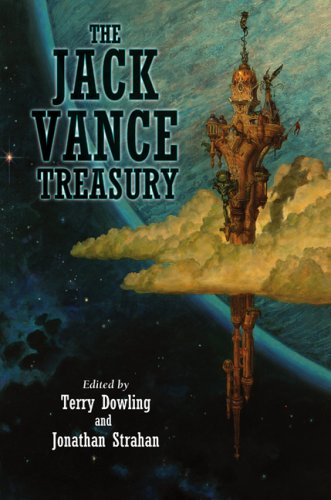
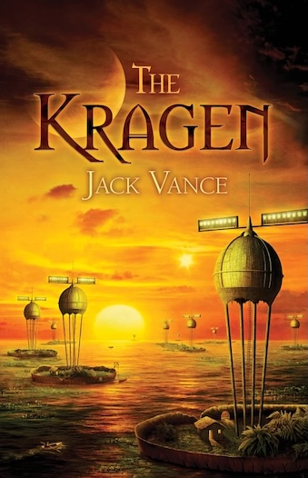
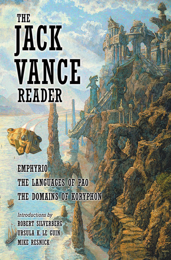

# Subterranean Press: Publications in Chronological Order
Subterranean Press (Burton, Michigan, founded 1995 by William Schafer) became the primary specialty publisher of Jack Vance material in the mid-to-late 2000s, coinciding with the Vance Integral Edition's completion and Vance's final years. Most of the fiction volumes below were edited by Terry Dowling and Jonathan Strahan and use VIE-restored texts rather than the original, often magazine-cut, printings.
## 2007
- *The Jack Vance Treasury* — collection (ed. Dowling & Strahan); Locus Award 2008, 2nd place, Collection

- *The Kragen* — chapbook, standalone edition of the 1964 novella that later became the source text for *The Blue World*

## 2008
- *The Jack Vance Reader* — collection (ed. Dowling & Strahan). Sources disagree on the exact year: Terry Dowling's own bibliography gives July 2008, but the publisher's current product-page metadata shows 2011, likely reflecting a later restock rather than the true first edition.

## 2009
- *Wild Thyme, Green Magic* — collection (ed. Dowling & Strahan)
- *This Is Me, Jack Vance!* — autobiography, dictated to Jeremy Cavaterra; won the 2010 Hugo Award, Best Related Work (see also `Composition-Contexts.md` for content mined from it)
- *Songs of the Dying Earth: Stories in Honor of Jack Vance* — tribute anthology of new stories by other authors set in the Dying Earth universe, not written by Vance (ed. Gardner Dozois & George R.R. Martin)
## 2010
- *Hard-Luck Diggings: The Early Jack Vance*, Vol. 1 — collection (ed. Dowling & Strahan), 14 early stories each followed by a Vance-written afterword
## 2011
- *Dangerous Ways: Selected Mysteries* — mystery omnibus (introduction by Dowling & Strahan)
## 2012
- *Dream Castles: The Early Jack Vance*, Vol. 2 — collection (ed. Dowling & Strahan); Locus Award 2013, 11th place, Collection
- *Desperate Days: Selected Mysteries*, Vol. 2 — mystery omnibus (ed. Dowling & Strahan)
## 2013
- *Magic Highways: The Early Jack Vance*, Vol. 3 — collection (ed. Dowling & Strahan). Sources disagree on the exact story list — see Notes.
- *The Dying Earth* — a new, illustrated edition of the original 1950 story-cycle (illus. Tom Kidd), distinct from the two Underwood-Miller hardcovers of the same title (1976, 1994; see `Underwood-Miller.md`)
## 2014
- *Minding the Stars: The Early Jack Vance*, Vol. 4 — collection (ed. Dowling & Strahan)
## 2015
- *Grand Crusades: The Early Jack Vance*, Vol. 5 — collection (ed. Dowling & Strahan), 1,000 copies; the final volume of the five-volume "Early Jack Vance" series
## Notes
- *Magic Highways* Vol. 3 story-list discrepancy: the publisher's current site copy lists Phalid's Fate, Planet of the Black Dust, Ultimate Quest, Men of the Ten Books, The Planet Machine, Dover Spargill's Ghastly Floater, Winner Lose All, Sabotage on Sulfur Planet, The House Lords, Sanatoris Short-Cut, The Unspeakable McInch, The Sub-Standard Sardines, The Howling Bounders, The King of Thieves, The Spa of the Stars, and To B or Not to C or to D, while a 2014 blog report of the same publisher's original jacket copy instead lists Dead Ahead in place of "Ultimate Quest," and The Uninhibited Robot and The Visitors in place of "Men of the Ten Books"/"The Planet Machine." "Ultimate Quest" and "Dead Ahead" are known variant titles of the same story per `VIE.md`, so this may not be a real content difference, but it has not been reconciled title-by-title.
- Sources consulted: subterraneanpress.com's own product pages (publisher-primary, though the site's "year" field sometimes reflects a later restock rather than the true first edition); ISFDB publication/title records; Terry Dowling's own bibliography page (he co-edited every fiction volume above); Black Gate's blog coverage of the "Early Jack Vance" series (used for supplementary story-level detail); and Publishers Weekly reviews.
- Open items: reconcile the *Magic Highways* discrepancy above title-by-title; confirm *The Jack Vance Reader*'s true first-edition year; independently re-verify the two mystery omnibuses' page counts against ISFDB directly rather than the publisher's site and Publishers Weekly.

# Subterranean Press Contents: Collections and Their Story Lists
For collections, anthologies, and omnibuses only.
## The Jack Vance Treasury (2007)
- Preface (Jack Vance)
- "Jack Vance: An Appreciation" (George R.R. Martin)
- Introduction: Fruit from the Tree of Life
- The Dragon Masters
- Liane the Wayfarer
- Sail 25
- The Gift of Gab
- The Miracle Workers
- Guyal of Sfere
- Noise
- The Kokod Warriors
- The Overworld
- The Men Return
- The Sorcerer Pharesm
- The New Prime
- The Secret
- The Moon Moth
- The Bagful of Dreams
- The Mitr
- Morreion
- The Last Castle
- "Biographical Sketch & Other Facts" (Jack Vance)
## The Jack Vance Reader (2008)
- Emphyrio
- The Domains of Koryphon
- The Languages of Pao
## Wild Thyme, Green Magic (2009)
- Introduction (Terry Dowling & Jonathan Strahan)
- Assault on a City
- Green Magic
- The World-Thinker
- The Augmented Agent
- Coup de Grace
- Chateau d'If
- The Potters of Firsk
- The Seventeen Virgins
- Ullward's Retreat
- Seven Exits from Bocz
- Wild Thyme and Violets (an outline, not a finished story)
- Rumfuddle
- "A Different View of Jack Vance" (essay, Norma Vance)
- "A Jack Vance Biography" (essay, Norma Vance)
## Hard-Luck Diggings: The Early Jack Vance, Vol. 1 (2010)
- Introduction
- Hard-Luck Diggings (with Vance's own afterword)
- The Temple of Han (with afterword)
- The Masquerade on Dicantropus (with afterword)
- Abercrombie Station (with afterword)
- Three-Legged Joe (with afterword)
- DP! (with afterword)
- Shape-Up (with afterword)
- Sjambak (with afterword)
- The Absent-Minded Professor (with afterword)
- When the Five Moons Rise (with afterword)
- The Devil on Salvation Bluff (with afterword)
- Where Hesperus Falls (with afterword)
- The Phantom Milkman (with afterword)
- Dodkin's Job (with afterword)
## Dangerous Ways: Selected Mysteries (2011)
- The Man in the Cage
- Bad Ronald
- The Deadly Isles
## Dream Castles: The Early Jack Vance, Vol. 2 (2012)
- The Dogtown Tourist Agency
- Freitzke's Turn
- I'll Build Your Dream Castle
- Golden Girl
- Sulwen's Planet
- Cholwell's Chickens
- A Practical Man's Guide
- The Narrow Land
- The Enchanted Princess
- Son of the Tree
## Desperate Days: Selected Mysteries, Vol. 2 (2012)
- Introduction (Dowling & Strahan)
- The Fox Valley Murders
- The Pleasant Grove Murders
- The Dark Ocean
- "The Genesee Slough Murders: Outline for a Novel" (lettered edition only)
## Magic Highways: The Early Jack Vance, Vol. 3 (2013)
See the story-list discrepancy noted above.
- Introduction
- Phalid's Fate
- Planet of the Black Dust
- Ultimate Quest (also reported as Dead Ahead)
- Men of the Ten Books (also reported as The Uninhibited Robot and The Visitors)
- The Planet Machine
- Dover Spargill's Ghastly Floater
- Winner Lose All
- Sabotage on Sulfur Planet
- The House Lords
- Sanatoris Short-Cut
- The Unspeakable McInch
- The Sub-Standard Sardines
- The Howling Bounders
- The King of Thieves
- The Spa of the Stars
- To B or Not to C or to D
## Minding the Stars: The Early Jack Vance, Vol. 4 (2014)
- Introduction
- Nopalgarth (a variant of The Brains of Earth)
- Telek
- Four Hundred Blackbirds
- Alfred's Ark
- Meet Miss Universe
- The World Between
- Milton Hack from Zodiac
- Parapsyche
## Grand Crusades: The Early Jack Vance, Vol. 5 (2015)
- Introduction
- The Rapparee
- Crusade to Maxus
- Gold and Iron
- The Houses of Iszm
- Space Opera
## The Dying Earth (2013, illustrated edition)
- Mazirian the Magician
- Turjan of Miir
- T'sais
- Liane the Wayfarer
- Ulan Dhor Ends a Dream
- Guyal of Sfere
## Songs of the Dying Earth: Stories in Honor of Jack Vance (2009)
A tribute anthology of new stories by other authors, not by Vance; contents not tabulated here since they fall outside this project's Vance bibliography.
