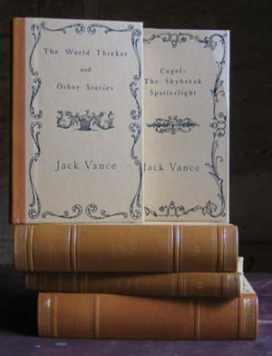

# The Vance Integral Edition: Volumes in Chronological Release Order
The Vance Integral Edition (VIE) was published as a fixed 44-volume set (plus two earlier promotional volumes) between 2001 and 2006. It was not released all at once: two sample/promotional volumes appeared first, then the bulk of the set arrived to subscribers in two large "waves," and one further volume was issued afterward to replace content withdrawn for rights reasons. The list below gives every VIE book in that real-world release order — not the reading/writing order encoded in the volume numbers themselves (for that, see the 1–44 sequence noted alongside each entry).

The VIE was officially incorporated on January 15th, 2001, as a nonprofit corporation in the state of California. 

Who led it: The project was conceived and led by Paul Rhoads (an American painter living in France), who served as editor-in-chief. The actual incorporated officers, were:
•  John Vance II (Jack's son) — President
•  Paul Rhoads — Vice President
•  Norma Vance — Secretary
•  Ed Winskill — Treasurer
•  Mike Berro — board member (credited elsewhere as the person who first launched the VIE idea)

[VIE: The Vance Integral Edition](https://www.integralarchive.org/) is the official site for the project, with a full set of bibliographic and textual information on every volume, including story-level first-publication data. The site also hosts a complete archive of the VIE's original web content, including the original "VIE Notes" essays and other editorial apparatus.

> NOTE: The restoration of Vance's authorial texts in the VIE is a major scholarly achievement, the restored texts are the definitive versions of Vance's work, and the VIE is the only edition that presents them all together. The VIE is a limited-edition set, and it is no longer in print. The VIE is not a "fan project" — it was a professional publishing effort with a nonprofit corporate structure, and it was produced with the full cooperation of Jack Vance and his family.
>
> People that want to buy the VIE should be aware that the set is no longer in print, and that any copies for sale are likely to be expensive. Lucklily Spatterlight Press has reprinted the VIE in a new edition, which is available for purchase. See `SpatterlightPress.md` for details. Same for ebooks (amazon.com, etc.) — the VIE is no longer available in ebook form, but Spatterlight Press has reissued the VIE as a new ebook edition.

## 2001 — Promotional volume
Released ahead of the main set as a sample/introduction to the edition.
- **Vol. i** — *Coup de Grace and Other Stories* ("The Gift Volume")
## 2002 — Promotional volume and Wave 1
A second promotional volume, followed by the first wave of the main set, delivered to subscribers in spring 2003.
- **Vol. ii** — *The Languages of Pao and The Dragon Masters* ("The Science Fiction Volume")
- **Vol. 1** — *Mazirian the Magician*
- **Vol. 4** — *The Rapparee / Big Planet / Vandals of the Void*
- **Vol. 6** — *Golden Girl and Other Stories*
- **Vol. 7** — *Gold and Iron / Clarges / The Languages of Pao*
- **Vol. 9** — *The Miracle Workers / The Dragon Masters / The Last Castle*
- **Vol. 10** — *The Flesh Mask / Strange People, Queer Notions / Bird Island*
- **Vol. 11** — *The House on Lily Street / The View from Chickweed's Window*
- **Vol. 12** — *Bad Ronald / The Dark Ocean*
- **Vol. 17** — *The Moon Moth and Other Stories*
- **Vol. 20** — *Emphyrio*
- **Vol. 25** — *The Face*
- **Vol. 26** — *The Book of Dreams*
- **Vol. 28** — *The Domains of Koryphon*
- **Vol. 29** — *Trullion: Alastor 2262*
- **Vol. 30** — *Marune: Alastor 933*
- **Vol. 31** — *Wyst: Alastor 1716*
- **Vol. 36** — *Suldrun's Garden*
- **Vol. 37** — *The Green Pearl*
- **Vol. 38** — *Madouc*
- **Vol. 39** — *Araminta Station*
- **Vol. 40** — *Ecce and Old Earth*
- **Vol. 42** — *Night Lamp*
## 2005 — Wave 2
The remaining volumes of the set, completing delivery to subscribers.
- **Vol. 2** — *The World-Thinker and Other Stories*
- **Vol. 3** — *Gadget Stories*
- **Vol. 5** — *Son of the Tree and Other Stories*
- **Vol. 8** — *The Houses of Iszm and Other Stories*
- **Vol. 13** — *The Fox Valley Murders / The Pleasant Grove Murders*
- **Vol. 14** — *The Man in the Cage / The Deadly Isles*
- **Vol. 15** — *Cugel the Clever*
- **Vol. 16** — *The Blue World*
- **Vol. 18** — *Space Opera*
- **Vol. 19** — *The Magnificent Showboats of the Lower Vissel River, Lune XXIII South, Big Planet*
- **Vol. 21** — *Tschai*
- **Vol. 22** — *The Star King*
- **Vol. 23** — *The Killing Machine*
- **Vol. 24** — *The Palace of Love*
- **Vol. 27** — *Durdane*
- **Vol. 32** — *The Dogtown Tourist Agency and Freitzke's Turn*
- **Vol. 33** — *Maske: Thaery*
- **Vol. 34** — *Rhialto the Marvellous*
- **Vol. 35** — *Cugel: The Skybreak Spatterlight*
- **Vol. 41** — *Throy*
- **Vol. 43** — *Ports of Call*
- **Vol. 44** — *Wild Thyme and Violets, Other Unpublished Works and Addenda*
## 2006 — Supplementary volume
Issued after the main set. The original Vol. 14 grouping had included the three Ellery Queen house-name mysteries; rights complications over the Queen pseudonym required withdrawing that content, so a replacement volume was produced from Vance's own manuscripts under his intended, non-Queen titles.
- **Vol. 14 bis** — *Strange She Hasn't Written / Death of a Solitary Chess Player / The Man Who Walks Behind* (authorial texts replacing the withdrawn Ellery Queen versions of *The Four Johns*, *A Room to Die In*, and *The Madman Theory*)
## Notes
- The VIE set is 44 numbered volumes; volumes i and ii are earlier promotional/sample publications outside that numbering, reissuing material later folded into or duplicated by the numbered set. Vol. 14 bis is likewise outside the 1–44 numbering, issued to complete Vol. 14 after the Ellery Queen withdrawal.
- Release dates for individual volumes within Wave 1 and Wave 2 are not independently documented; volumes are listed by ascending volume number within each wave. See `references/local-archive.md` and `references/vance-life-and-works.md` in the `vance-doctorate-analysis` skill for sourced detail on VIE textual history, and Foreverness (integralarchive.org) for the primary project record.

# Volume Contents: First Publication and Alternate Titles
Every VIE volume is a facsimile of the *authorial* text under Vance's own preferred title. Many of these titles differ from the title under which the piece first reached print — magazines and book editors routinely renamed Vance's work. The lists below give, for every story, novella, and novel inside each volume: the VIE/authorial title; any other title(s) it was published or is commonly known under; and its first publication (magazine/anthology/book and date, with publisher for book-original work). Where a title had no prior periodical appearance and was original to a book, that book is given as the first publication. Uncredited apparatus (indexes, credits lists, essays) in Vol. 44 is noted but not tabulated as fiction.

## Vol. i — Coup de Grace and Other Stories ("The Gift Volume", 2001)
A promotional sampler assembled before the numbered set; its fiction content overlaps numbered volumes below (notably "Coup de Grace," collected in Vol. 17) rather than introducing unique first-publication data.

## Vol. ii — The Languages of Pao and The Dragon Masters ("The Science Fiction Volume", 2002)
A second promotional sampler pairing two already-scheduled numbered-volume contents (Vol. 7 and Vol. 9 below); see those volumes for first-publication data.

## Vol. 1 — Mazirian the Magician
All six stories were written for and first published together in *The Dying Earth*, Hillman Periodicals, 1950 (paperback #41) — none had a prior magazine appearance. The book's editorial title, *The Dying Earth*, is used for the whole cycle; Vance's preferred title is *Mazirian the Magician*.
- **Turjan of Miir** — first published in *The Dying Earth*, Hillman Periodicals, 1950.
- **Mazirian the Magician** — first published in *The Dying Earth*, Hillman Periodicals, 1950.
- **T'sais** — first published in *The Dying Earth*, Hillman Periodicals, 1950.
- **Liane the Wayfarer** (also published as "The Loom of Darkness", *Worlds Beyond*, December 1950) — first published in *The Dying Earth*, Hillman Periodicals, 1950.
- **Ulan Dhor Ends a Dream** (also as "Ulan Dhor") — first published in *The Dying Earth*, Hillman Periodicals, 1950.
- **Guyal of Sfere** — first published in *The Dying Earth*, Hillman Periodicals, 1950. (A revised version appears separately in Vol. 44.)

## Vol. 2 — The World-Thinker and Other Stories
- **The World-Thinker** — *Thrilling Wonder Stories*, Summer 1945.
- **I'll Build Your Dream Castle** — *Astounding Science Fiction*, September 1947.
- **The Ten Books** (published as "Men of the Ten Books") — *Startling Stories*, March 1951.
- **The God and the Temple Robber** (published as "Temple of Han") — *Planet Stories*, July 1951.
- **Telek** — *Astounding Science Fiction*, January 1952.
- **Noise** — *Startling Stories*, August 1952.
- **Seven Exits from Bocz** — *The Rhodomagnetic Digest*, Volume IV, issue #21, number 2, 1952.
- **DP!** — *Avon Science Fiction and Fantasy Reader*, April 1953.
- **The Absent-Minded Professor** (published as "First Star I See Tonight", under the pseudonym John Van See; later reprinted as "Murder Observed") — *Malcolm's Mystery Magazine*, March 1954.
- **The Devil on Salvation Bluff** — *Star Science Fiction Stories No. 3*, ed. Frederik Pohl, Ballantine, January 1955.
- **The Phantom Milkman** — *Other Worlds Science Stories* #15, February 1956.
- **Where Hesperus Falls** — *Fantastic Universe*, October 1956.
- **A Practical Man's Guide** — *Space Science Fiction Magazine*, August 1957.
- **The House Lords** — *Saturn, Magazine of Science Fiction and Fantasy*, October 1957.
- **The Secret** — *Impulse*, March 1966.

## Vol. 3 — Gadget Stories
- **Planet of the Black Dust** (Alternate title "Planet of the Red Star")— *Startling Stories*, Summer 1946.
- **Dead Ahead** (published as "Ultimate Quest", under the pseudonym John Holbrook) — *Super Science Stories*, September 1950.
- **Hard Luck Diggings** [Magnus Ridolph] — *Startling Stories*, July 1948.
- **Sanatoris Short-Cut** [Magnus Ridolph] — *Startling Stories*, September 1948.
- **The Unspeakable McInch** [Magnus Ridolph] — *Startling Stories*, November 1948.
- **The Howling Bounders** [Magnus Ridolph] — *Startling Stories*, March 1949.
- **The King of Thieves** [Magnus Ridolph] — *Startling Stories*, November 1949.
- **The Sub-Standard Sardines** [Magnus Ridolph] (The Case of the Sub-standard Sardines (a.k.a.) and The Sub-standard Sardines (a.k.a.)) — *Startling Stories*, January 1949.
- **To B or Not to C or to D** (published as "Cosmic Hotfoot") [Magnus Ridolph] — *Startling Stories*, September 1950.
- **The Spa of the Stars** [Magnus Ridolph] — *Startling Stories*, July 1950.
- **The Enchanted Princess** (later reprinted as "The Dreamer", Alternate title "The Enchanted Princess and Roger Atkin") — *Orbit*, v1 #5, 1954.
- **The Potters of Firsk** — *Astounding Science Fiction*, May 1950.
- **The Visitors** (published as "Winner Lose All") — *Galaxy Science Fiction*, December 1951.
- **The Uninhibited Robot** (published as "The Plagian Siphon", Alternate title "The Planet Machine") — *Thrilling Wonder Stories*, October 1951.
- **Dover Spargill's Ghastly Floater** — *Marvel Science Fiction*, November 1951.
- **Sabotage on Sulfur Planet** — *Startling Stories*, June 1952.
- **Three-Legged Joe** — *Startling Stories*, January 1953.
- **Four Hundred Blackbirds** — *Future Science Fiction*, July 1953.
- **Sjambak** — *If*, July 1953.
- **Parapsyche** — *Amazing Science Fiction Stories*, August 1958. (Not to be confused with "Coup de Grace," which was itself first published under the title "Worlds of Origin" — see Vol. 17.)
- **Sail 25** (published as "Gateway to Strangeness"; later reprinted as "Dust of Far Suns") — *Amazing Stories*, August 1962.

## Vol. 4 — The Rapparee / Big Planet / Vandals of the Void
- **The Rapparee** (published as "The Five Gold Bands"; also as "The Space Pirate") — *Startling Stories*, November 1950.
- **Big Planet** — *Startling Stories*, September 1952 (magazine text cut nearly in half at the editor's request; the excised material is lost). First full-length book publication: Avalon Books, 1957.
- **Vandals of the Void** — first published as a book (juvenile SF, no prior serialization): The John C. Winston Company, 1953.

## Vol. 5 — Son of the Tree and Other Stories
- **Phalid's Fate** — *Thrilling Wonder Stories*, December 1946.
- **Chateau d'If** (published as "New Bodies for Old") — *Thrilling Wonder Stories*, August 1950.
- **Crusade to Maxus** (published as "Overlords of Maxus", Call for the New Crusade (Draft Title), Crazy Crusade (Draft Title), Crusade to Alambar (Draft Title) , New Crusade, The (Draft Title)) — *Thrilling Wonder Stories*, February 1951.
- **Son of the Tree** — *Thrilling Wonder Stories*, June 1951.
- **Shape-Up** — *Cosmos Science Fiction and Fantasy*, November 1953.
- **The Augmented Agent** (published as "I-C-a-BeM") — *Amazing Stories*, October 1961.
- **Milton Hack from Zodiac** (published as "The Man from Zodiac", Phronus-Sabo Contract (Draft Title)) — *Amazing Stories*, August 1967.

## Vol. 6 — Golden Girl and Other Stories
- **Golden Girl** Shipwreck on Matemba (Draft Title) — *Marvel Science Stories*, May 1951. 
- **Masquerade on Dicantropus** — *Startling Stories*, September 1951.
- **Abercrombie Station** [Jean Parlier] (Monsters in Orbit, a.k.a.) — *Thrilling Wonder Stories*, February 1952.
- **Cholwell's Chickens** [Jean Parlier] — *Thrilling Wonder Stories*, August 1952.
- **The Mitr** — *Vortex Science Fiction*, v1 #1, 1953.
- **The World Between** (published as "Ecological Onslaught") — *Future Science Fiction*, May 1953.
- **When the Five Moons Rise** — *Cosmos Science Fiction and Fantasy*, March 1954.
- **Meet Miss Universe** — *Fantastic Universe*, March 1955.
- **The Insufferable Red-Headed Daughter of Commander Tynnott, O.T.E.** (published as "Assault on a City"; Hugo, Locus, and Jupiter Award finalist) — *Universe 4*, ed. Terry Carr, Random House, 1974.

## Vol. 7 — Gold and Iron / Clarges / The Languages of Pao
- **Gold and Iron** (published as "Slaves of the Klau"; magazine text as "Planet of the Damned") — *Space Stories*, December 1952 (abridged); Ace Books, 1958 (book).
- **Clarges** (published as "To Live Forever") — Ballantine Books, 1956 (book original; no prior serialization).
- **The Languages of Pao** — *Satellite Science Fiction*, December 1957; Avalon Books, 1958 (book).

## Vol. 8 — The Houses of Iszm and Other Stories
- **The Houses of Iszm** — *Startling Stories*, Spring 1954.
- **The Gift of Gab** — *Astounding Science Fiction*, September 1955.
- **Nopalgarth** (published as "The Brains of Earth") — Ace Books, 1966 (book original; no prior serialization).
- **The Narrow Land** — *Fantastic*, July 1967. Alternate title: "Clutch of the Careless One-Woman" (Draft Title).

## Vol. 9 — The Miracle Workers / The Dragon Masters / The Last Castle
- **The Miracle Workers** — *Astounding Science Fiction*, July 1958.
- **The Dragon Masters** (Hugo Award, Best Short Fiction, 1963) — *Galaxy Magazine*, August 1962.
- **The Last Castle** (Nebula Award 1966; Hugo Award 1967) — *Galaxy Science Fiction*, April 1966.

## Vol. 10 — The Flesh Mask / Strange People, Queer Notions / Bird Island
- **The Flesh Mask** (published as "Take My Face", under the editorial pseudonym Peter Held) — Mystery House, 1957.
- **Strange People, Queer Notions** (published as "Strange Notions") — Underwood-Miller, 1985 (Vance's most delayed mystery to reach print).
- **Bird Island** (published as "Isle of Peril", under the editorial pseudonym Alan Wade; also as "Bird Isle"; draft title "Forbidden Island") — Mystery House, 1957.

## Vol. 11 — The House on Lily Street / The View from Chickweed's Window
- **The House on Lily Street** — Underwood-Miller, 1979.
- **The View from Chickweed's Window** — Underwood-Miller, 1978.

## Vol. 12 — Bad Ronald / The Dark Ocean
- **Bad Ronald** (draft title "Something Awful"; published as by John Holbrook Vance; filmed for ABC television 1974 and as *Méchant garçon*, France, 1992) — Ballantine Books, 1973.
- **The Dark Ocean** — Underwood-Miller, 1985.

## Vol. 13 — The Fox Valley Murders / The Pleasant Grove Murders
- **The Fox Valley Murders** [Sheriff Joe Bain] (published as by John Holbrook Vance) — Bobbs-Merrill, 1966.
- **The Pleasant Grove Murders** [Sheriff Joe Bain] (published as by John Holbrook Vance) — Bobbs-Merrill, 1967.
- 

## Vol. 14 — The Man in the Cage / The Deadly Isles
- **The Man in the Cage** (Edgar Award, Best First Novel, 1961; published as by John Holbrook Vance) — Random House, 1960. (Draft Title: "No-one knows where he went".)
- **The Deadly Isles** (published as by John Holbrook Vance) — Bobbs-Merrill, 1969.
- **The Genesee Slough Murders** (Outline for a novel, never completed; published as by John Holbrook Vance) — *The Magazine of Fantasy and Science Fiction*, October 1960. (FACT CHECK?)

## Vol. 14 bis — Strange She Hasn't Written / Death of a Solitary Chess Player / The Man Who Walks Behind
These are Vance's own authorial texts of the three Ellery Queen house-name mysteries, restored decades later from manuscript fragments found on the reverse of other typescripts; the editorially "tarted up" Ellery Queen versions remain separately in print under their own titles.
- **Strange She Hasn't Written** (published as "The Four Johns", house name Ellery Queen; UK as "Four Men Called John") — Pocket Books, 1964.
- **Death of a Solitary Chess Player** (published as "A Room to Die In", house name Ellery Queen) — Pocket Books, 1965.
- **The Man Who Walks Behind** (published as "The Madman Theory", house name Ellery Queen) — Pocket Books, 1966.

## Vol. 15 — Cugel the Clever (author's title for The Eyes of the Overworld)
- **The Overworld** [Cugel; Dying Earth] — *The Magazine of Fantasy and Science Fiction*, December 1965.
- **Cil** [Cugel; Dying Earth] — no prior magazine appearance; first published in *The Eyes of the Overworld*, Ace Books, 1966.
- **The Mountains of Magnatz** [Cugel; Dying Earth] — *F&SF*, February 1966.
- **The Sorcerer Pharesm** [Cugel; Dying Earth] — *F&SF*, April 1966.
- **The Pilgrims** [Cugel; Dying Earth] — *F&SF*, June 1966.
- **The Cave in the Forest** and **The Manse of Iucounu** [Cugel; Dying Earth] — both first published together as "The Manse of Iucounu," *F&SF*, July 1966; later divided into two chapters/stories for the VIE text.

## Vol. 16 — The Blue World
- **The Blue World** (draft title "King Kragen") — Ballantine Books, 1966 (book original; expanded from the novella "The Kragen," *Fantastic Stories of Imagination*, July 1964 — see also Vol. 44).

## Vol. 17 — The Moon Moth and Other Stories
- **The Kokod Warriors** [Magnus Ridolph] — *Thrilling Wonder Stories*, October 1952.
- **The New Prime** (published as "Brain of the Galaxy") — *Worlds Beyond*, February 1951.
- **The Men Return** — *Infinity Science Fiction*, July 1957.
- **Ullward's Retreat** — *Galaxy Magazine*, December 1958.
- **Coup de Grace** (published as "Worlds of Origin") [Magnus Ridolph] — *Super-Science Fiction*, February 1958.
- **Dodkin's Job** — *Astounding Science Fiction*, October 1959.
- **The Moon Moth** — *Galaxy Magazine*, August 1961.
- **Green Magic** — *F&SF*, June 1963.
- **Alfred's Ark** (draft title "Alfred") — *New Worlds SF* #150, May 1965.
- **Sulwen's Planet** (draft title "A Canceling of Unknowns") — *The Farthest Reaches*, ed. Joseph Elder, Trident Press, August 1968.
- **Rumfuddle** — *Three Trips in Time and Space*, ed. Robert Silverberg, Hawthorn Books, January 1973.

## Vol. 18 — Space Opera
- **Space Opera** — Pyramid Publications, 1965 (book original; no prior serialization found).

## Vol. 19 — The Magnificent Showboats of the Lower Vissel River, Lune XXIII South, Big Planet
- (published as "Showboat World") — Pyramid Publications, 1975 (book original; retroactively conceived sequel to *Big Planet*).

## Vol. 20 — Emphyrio
- **Emphyrio** — *Fantastic*, June and August 1969 (2 parts); Doubleday, 1969 (book).

## Vol. 21 — Tschai
All four Planet of Adventure novels were Ace paperback originals with no prior magazine serialization.
- **The Chasch** (published as "City of the Chasch") — Ace Books, 1968.
- **The Wannek** (published as "Servants of the Wankh"; later reissued as "Wankh") — Ace Books, 1969.
- **The Dirdir** — Ace Books, 1969.
- **The Pnume** — Ace Books, 1970.

## Vol. 22 — The Star King [Kirth Gersen; Demon Princes]
- **The Star King** — *Galaxy Magazine*, December 1963 and February 1964 (2 parts); Berkley Publishing, 1964 (book).

## Vol. 23 — The Killing Machine [Kirth Gersen; Demon Princes]
- **The Killing Machine** — Berkley Publishing, 1964 (book original; no prior serialization found).

## Vol. 24 — The Palace of Love [Kirth Gersen; Demon Princes]
- **The Palace of Love** — *Galaxy Science Fiction*, October and December 1966, February 1967 (3 parts); Berkley Publishing, 1967 (book).

## Vol. 25 — The Face [Kirth Gersen; Demon Princes]
- **The Face** — DAW Books, 1979 (book original; no prior serialization).

## Vol. 26 — The Book of Dreams [Kirth Gersen; Demon Princes]
- **The Book of Dreams** — DAW Books, 1981 (book original; no prior serialization).

## Vol. 27 — Durdane
- **The Anome** (published as "The Faceless Man") — *F&SF*, February and March 1971 (2 parts); Dell, 1973 (book).
- **The Brave Free Men** (draft title "Palasedra") — *F&SF*, July and August 1972 (2 parts); Dell, 1973 (book).
- **The Asutra** — *F&SF*, May and June 1973 (2 parts); Dell, 1974 (book).

## Vol. 28 — The Domains of Koryphon [Gaean Reach]
- (published as "The Gray Prince"; also "The Grey Prince") — *Amazing Science Fiction Stories*, August and October 1974 (2 parts); Bobbs-Merrill, 1974 (book).

## Vol. 29 — Trullion: Alastor 2262 [Gaean Reach]
- **Trullion: Alastor 2262** — *Amazing Science Fiction Stories*, March and June 1973 (2 parts); Ballantine Books, 1973 (book).

## Vol. 30 — Marune: Alastor 933 [Gaean Reach]
- **Marune: Alastor 933** — *Amazing Science Fiction Stories*, July and September 1975 (2 parts); Ballantine Books, 1975 (book).

## Vol. 31 — Wyst: Alastor 1716 [Gaean Reach]
- **Wyst: Alastor 1716** — DAW Books, 1978 (book original; no prior serialization found).

## Vol. 32 — The Dogtown Tourist Agency and Freitzke's Turn [Miro Hetzel]
Collected together under the editorial title *Galactic Effectuator* (Underwood-Miller, 1980); the VIE restores the two novellas separately under this volume title.
- **The Dogtown Tourist Agency** — *Epoch*, ed. Roger Elwood & Robert Silverberg, Berkley/Putnam, 1975.
- **Freitzke's Turn** — *Triax*, ed. Robert Silverberg, Pinnacle Books, 1977.

## Vol. 33 — Maske: Thaery
- **Maske: Thaery** — Berkley Publishing, 1976 (book original; no prior serialization found).

## Vol. 34 — Rhialto the Marvellous [Dying Earth]
First collected as a trio ("two new and one revised") in the Brandywyne Books limited edition.
- **The Murthe** — first published in *Rhialto the Marvellous*, Brandywyne Books, August 1984.
- **Fader's Waft** — first published in *Rhialto the Marvellous*, Brandywyne Books, August 1984.
- **Morreion** — *Flashing Swords!* #1, ed. Lin Carter, Science Fiction Book Club, April 1973 (revised for the VIE text).

## Vol. 35 — Cugel: The Skybreak Spatterlight [Dying Earth]
Author's title for the editorially named *Cugel's Saga*; a fix-up of two previously published novellas plus new connective material.
- **The Seventeen Virgins** [Cugel; Dying Earth] (Jupiter Award, 1975) — *F&SF*, October 1974.
- **The Bagful of Dreams** [Cugel; Dying Earth] — *Flashing Swords! #4: Barbarians and Black Magicians*, ed. Lin Carter, Dell, 1977.
- Connective and framing material original to *Cugel's Saga*, Timescape/Pocket Books, 1983 (book).

## Vol. 36 — Suldrun's Garden [Lyonesse]
- (published as "Lyonesse: Suldrun's Garden"; also as "Lyonesse") — Berkley Books, 1983 (book original; no prior serialization).

## Vol. 37 — The Green Pearl [Lyonesse]
- (published as "Lyonesse II: The Green Pearl") — Underwood-Miller, 1985 (book original; no prior serialization). Mass-market edition as "The Green Pearl," Berkley Books, 1986.

## Vol. 38 — Madouc [Lyonesse]
- (published as "Lyonesse: Madouc"; World Fantasy Award, Best Novel, 1990) — Underwood-Miller, 1989 (book original; no prior serialization). Mass-market edition as "Madouc," Ace Books, 1990.

## Vol. 39 — Araminta Station [Cadwal Chronicles]
- **Araminta Station** — Underwood-Miller, 1987 (book original; no prior serialization). Mass-market paperback, Tor Books, 1988.

## Vol. 40 — Ecce and Old Earth [Cadwal Chronicles]
- **Ecce and Old Earth** — Underwood-Miller, 1991 (book original; no prior serialization). Tor Books paperback edition followed.

## Vol. 41 — Throy [Cadwal Chronicles]
- **Throy** — Underwood-Miller, 1992 (book original; no prior serialization).

## Vol. 42 — Night Lamp
- **Night Lamp** — Tor Books, 1996 (book original; no prior serialization).

## Vol. 43 — Ports of Call
- **Ports of Call** — Tor Books, 1998 (book original; no prior serialization).
- **Lurulu** — Tor Books, 2004 (book original; no prior serialization; completes the single multi-part novel begun with *Ports of Call*).

## Vol. 44 — Wild Thyme and Violets, Other Unpublished Works and Addenda
- **Cat Island** (excerpt: first chapter and outline of an unfinished novel, written 1946) — first published in *Light from a Lone Star*, NESFA Press, August 1985.
- **The Stark: The Voyage and the People** (unfinished ms., an outline for an unwritten SF novel) — first published in this VIE volume, 2005.
- **Dream Castle** (revised version of "I'll Build Your Dream Castle," *Astounding*, September 1947 — see Vol. 2) — the revision first published under the title "Dream Castle" in *Lost Moons*, Underwood-Miller, June 1982.
- **The Kragen** [Dying Earth-adjacent; source novella for *The Blue World*, Vol. 16] — *Fantastic Stories of Imagination*, July 1964.
- **The Telephone Was Ringing in the Dark** (unfinished suspense novel ms.) — first published in this VIE volume, 2005.
- **Guyal of Sfere** (revised version; original 1950 text in Vol. 1) — this revised text first published in this VIE volume, 2005.
- **The Magnificent Red-Hot Jazzing Seven** (concept and synopsis for an unproduced screenplay) — first published in this VIE volume, 2005.
- **Wild Thyme and Violets** (outline for an unwritten gothic novel) — first published in this VIE volume, 2005.
- **Clang** (concept and synopsis for an unfinished screenplay, 1981) — first published in this VIE volume, 2005.
- Also included: "Chronological List of VIE Titles," Vance's own introductions/forewords/afterwords, essays by Tim Stretton and Alan Hughes on the VIE's history and textual methods, volunteer and text credits, and the "Catalogue of Titles" — reference apparatus rather than fiction, not tabulated here.

*Note on a later, non-VIE edition*: Spatterlight Press's 2018 trade paperback *Wild Thyme and Violets and Other Unpublished Works* revises this collection, dropping the VIE-specific apparatus and adding "The Genesee Slough Murders" (an outline for the unwritten third Sheriff Joe Bain novel, first published in *The Work of Jack Vance* by Jerry Hewett & Daryl F. Mallett, Underwood-Miller, 1994) — that story is not part of the original 2005 VIE Vol. 44.
